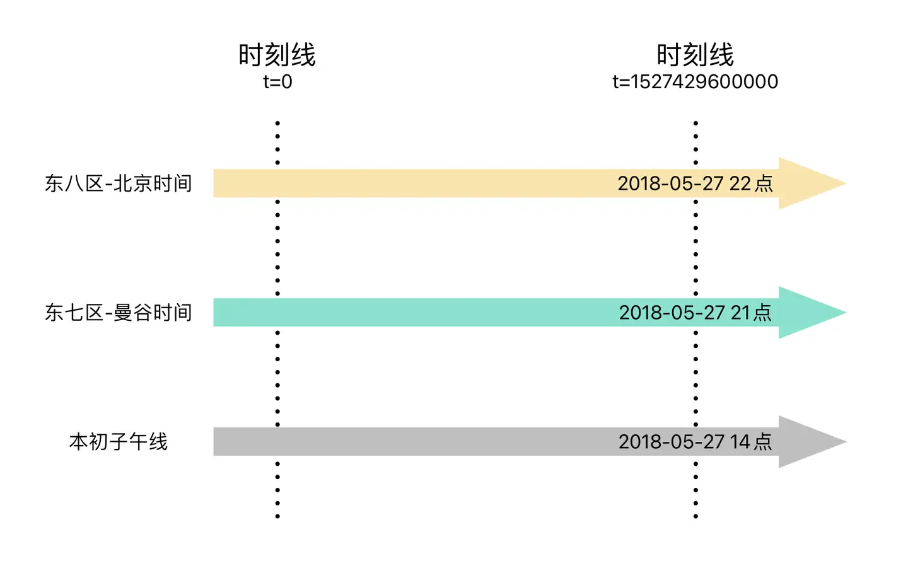

# Time Zone

## What is GMT and UTC?

### GMT

- **Hemispheres and Time Zones**: The Earth is split into two halves, known as the Eastern and Western hemispheres. Each hemisphere is further divided into 12 time zones.

-  **Time Zone Differences**: Time zones are separated by one hour. The total time difference around the globe is 24 hours, which represents a full day. When traveling west, you subtract an hour for each time zone you cross. When moving east, you add an hour for each time zone.
-  

-  **Prime Meridian and Time Zone Origin**: The starting point for measuring time zones and longitude is the Prime Meridian, which is located in London, England. This line is set by the Royal Observatory in Greenwich.
-  

-  **Zero Time Zone**: The Prime Meridian defines the zero time zone. This zone is known as GMT+00, with 'Z' being the common abbreviation for 'zero'. GMT stands for Greenwich Mean Time, which is the local time standard at the Greenwich location.

### UTC

Unix Time, also known as Epoch Time, is a system for measuring time by counting the number of seconds that have elapsed since January 1, 1970, at 00:00:00 Coordinated Universal Time (UTC), excluding leap seconds

- **Unix Time Definition**: It's a way to keep track of the passing of time by counting seconds from a specific starting point.

- **Starting Point (Epoch Time)**: The count begins at the "epoch" time, which is January 1, 1970, at 00:00:00 UTC.

- **Uniformity**: Regardless of where you are on Earth, Unix Time is the same everywhere because it's based on UTC, which is a time standard that is not affected by time zone differences or daylight saving changes.

- **Leap Seconds**: Unix Time does not include leap seconds, which are occasional one-second adjustments to UTC to compensate for variations in the Earth's rotation.

## What errors may occur across time zones?

**Question1:** If I use Taobao to place an order in Japan (1 hour faster than Beijing time), will I see the time in Japan time or Beijing time? Will the payment service be executed according to Beijing time or Japan time?

**Question2:** User A in San Francisco (16 hours slower than Beijing time) plans to book a transfer for user B in Beijing on 2023-01-01, but the backend receives it and treats it as Beijing time, so the transfer is made on Beijing time ‘2023-01-01’ (corresponding to San Francisco time 2022-12-31), and user B receives the money transfer 1 day earlier on 2022-12-31.

## How to deal with cross-time-zone?

**Storage Locations for Time:**
- **Client-side**: The user's device or browser, which is set to the local time zone.
- **Server**: The server that hosts the application, which may be set to a specific time zone.
- **Java Virtual Machine (JVM)**: The JVM running the application can be configured to use a specific time zone.
- **MySQL Database**: MySQL has its own time zone settings that are configured during installation.

**Process:**
1. The user's browser, based on the client's local time zone, retrieves the current time.
2. The browser sends this time, as a parameter, to the server.
3. The JVM, depending on its configuration, selects either the server's current time zone or a time zone that has been specifically set for it.
4. The selected time is then stored in the MySQL database, which has its own time zone setting configured.

**Requirement:**
To ensure that the time remains consistent when it is input and retrieved, the following considerations should be taken into account

## Example Code

